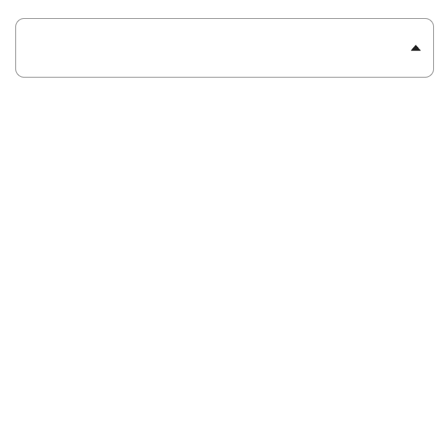

##  :star: ag-autocomplete

ag-autocomplete is a  multiselect react component, designed to be used in forms of react projects.
### :clapper: Demo
You can check the [AG Autocomplete Demo Page](https://arsendemirci-ag-autocomplete.netlify.app)  to see the examples in action. 

 

### :eyes: Overview

This project is actually a part of a vue3 component library  project that is under development right now.
ag-autocomplete is a custom component that takes advantage of many features of React. Designed with React + TypeScript and SCSS 
 

 &nbsp;&nbsp; &nbsp;&nbsp; 

 
 
